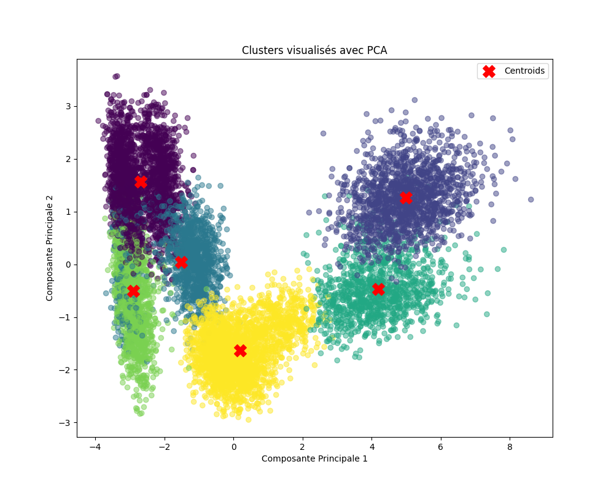

# KMM: Distributed Hybrid K-Means/K-Medoids Clustering

## Project Description

KMM (K-Means-Medoids) is a distributed hybrid clustering algorithm that combines the speed of [K-Means](https://en.wikipedia.org/wiki/K-means_clustering) with the robustness of [K-Medoids](https://en.wikipedia.org/wiki/K-medoids).  
It leverages distributed computing to efficiently solve clustering problems by exploiting the strengths of both methods.

## Working Principle of the Distributed Hybrid KMM Algorithm

### Overview of the Hybrid Algorithm

The hybrid [K-Means](https://en.wikipedia.org/wiki/K-means_clustering) / [K-Medoids](https://en.wikipedia.org/wiki/K-medoids) algorithm operates in three main phases:
- **Phase 1**: Run [K-Means](https://en.wikipedia.org/wiki/K-means_clustering) for a limited number of iterations (*r*).
- **Phase 2**: Replace centroids with [medoids](https://en.wikipedia.org/wiki/K-medoids) if this improves clustering quality.
- **Phase 3**: Continue [K-Means](https://en.wikipedia.org/wiki/K-means_clustering) until convergence, starting from the medoids.

This hybrid approach combines the rapid convergence of K-Means with the solution quality and robustness of K-Medoids, especially against outliers.

### Work Distribution Across Nodes

#### Role of the Master Node

The master node (*rank = 0*) is responsible for:
- **Preprocessing and Initialization**:
  - Load and preprocess the data (normalization, encoding).
  - Execute Phase 1: initial K-Means for *r* iterations.
- **Work Distribution**:
  - Identify clusters after Phase 1.
  - Create work packages, each containing one or more clusters.
  - Send the work packages to the worker nodes.
- **Aggregation and Finalization**:
  - Receive the medoids computed by the workers.
  - Update centroids with medoids when beneficial.
  - Execute Phase 3: final K-Means until convergence.
  - Visualize and analyze the final results.

#### Role of the Worker Nodes

Each worker node (*rank ≥ 1*) is responsible for:
- Receiving assigned clusters.
- Computing the medoid for each cluster.
- Sending the computed medoids back to the master node.

## Results

### Execution Time Comparison

| Algorithm         | Execution Time      |
|-------------------|---------------------|
| K-Means           | 0.3276 seconds      |
| K-Medoids         | 4.4735 seconds      |
| **KMM (Hybrid)**  | 1.827 seconds       |

### Visualizations

Here are some sample visualizations from the clustering process:

---

## Project Structure

The project structure is as follows:

- **README.md**: Project documentation
- **data/**: Contains dataset files
  - `retail_customer_dataset.csv`: Example dataset for clustering
- **code.ipynb**: Jupyter Notebook with the clustering implementation
- **distributed_arch/**: Distributed computing scripts and resources
  - `clustering_result.png`: Visualization of the clustering result
  - `hosts.txt`: Configuration file for worker nodes
  - `distributed_clustering.py`: Python script for distributed KMM algorithm
  - `run.sh`: Shell script to execute the distributed algorithm